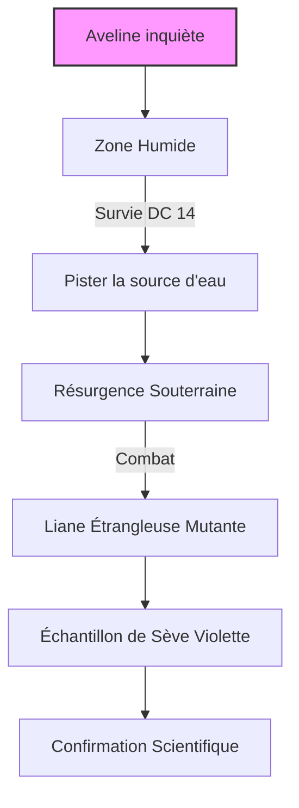

# Quête : La Racine du Mal

## Synopsis & Hook
> [!abstract] Objectif
> Aveline a besoin de plantes pour soigner, mais elle a remarqué que la forêt change. Elle veut des échantillons de la "nouvelle flore" pour comprendre.
> **Accroche :** "Les ronces bougent, Inquisiteur. Pas avec le vent. Avec une intention."

---

## Graphe de Décision (Logic)

## Scènes & Embranchements

 ### Scène 1 : La Zone Humide

> [!read-aloud] Description
> "La lisière de la forêt semble normale, mais à mesure que vous vous enfoncez vers la zone humide, les couleurs changent. Les fougères ne sont plus vertes, mais veinées de pourpre. L'odeur de l'humus est remplacée par une senteur douceâtre, presque chimique. Le silence est total : pas d'oiseaux, pas d'insectes. Seul un bruissement léger, comme un sifflement de serpent, vous accompagne. Autour de vous, les racines des arbres semblent pulser lentement, comme si elles respiraient."

- **Ambiance :** La végétation est luxuriante, trop verte, presque fluorescente par endroits.
- **Danger :** Les plantes ont absorbé l'élixir dilué depuis des jours. Elles sont devenues carnivores/agressives.

### Scène 2 : Le Gardien Vert
- **Ennemi :** Une **[[Liane Étrangleuse Mutante]]**.
- **Comportement :** Elle ne chasse pas pour manger, elle chasse par excès d'énergie vitale. Elle grandit à vue d'œil.
- **Combat :** Si on la coupe, sa sève brûle comme de l'acide (Acid Splash reaction).
### Scène 3 : La Preuve
- **Loot :** Un échantillon de racine gorgée de liquide violet.
- **Conclusion d'Aveline :** "C'est dans la sève. Tout ce qui pousse ici est poison. Ne mangez rien, ne chassez rien."

---

## Conséquences sur le Monde (World State)

- **Si Succès :**
    - Aveline peut créer un antidote partiel (Advantage sur les Saves contre le poison).
    - Simon cartographie la zone contaminée.

---

## Notes de Session (Log)

- **Choix des joueurs :** ...