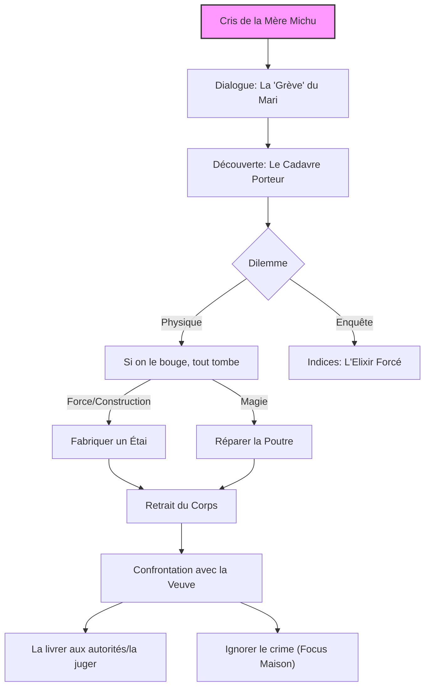

# Quête : L'Étai Humain

## Synopsis & Hook
> [!abstract] Objectif
> Découvrir la vérité sur le silence du charpentier, puis gérer la situation structurelle critique sans faire effondrer la maison.
> **Accroche :** Des hurlements stridents et des insultes résonnent dans la rue. Une femme énorme invective le plafond de sa propre maison.

---

## Graphe de Décision (Logic)

## Scènes & Embranchements

### Scène 1 : La Tyranne Immobile (RDC)
**Ambiance :** Une odeur de renfermé, de graisse et de sueur. La pièce est encombrée.
**PNJ : La Mère Michu**
- **Physique :** Obésité morbide, incapable de monter l'escalier, trône dans un fauteuil renforcé.
- **Attitude :** Agressive, vulgaire, castratrice.
- **Dialogue :** Elle hurle que son "bon à rien de mari" (Thomas) est monté réparer la charpente il y a deux jours et qu'il "fait la gueule" en haut sans répondre pour ne pas redescendre travailler.
- **L'Indice Clé :** Sur la table, un grand bol vide avec des résidus irisés (l'eau du puits). Elle admet fièrement : *"Je lui ai servi une double ration de l'élixir du maire pour qu'il soit un homme, pour une fois !"*

### Scène 2 : Le Silence de l'Étage (Grenier)
**Ambiance :** Contraste total. Silence de mort. Craquements sinistres du bois.
**La Découverte :**
- Thomas est mort, debout.
- **La Cause :** Il a bu l'eau (dopage), a soulevé la poutre maîtresse quand elle cédait. Ses os sont brisés (ouverts) par l'effort musculaire surnaturel induit par la potion, certains organes perforés.
- **L'État :** *Rigor Mortis Alchimique*. Il est dur comme la pierre, soudé à la charpente par la contraction. Son visage est figé dans un rictus d'agonie pure. On peut tout de même percevoir une forme de soulagement sur dans son regard...
- **Le Danger :** Il est le seul pilier porteur actuel. Le retirer sans précaution fera s'effondrer le toit sur la Mère Michu en dessous.

### Scène 3 : Le Poids de la Vérité
Il faut gérer le cadavre (problème physique) et la veuve (problème moral).

#### A. Le Problème Physique
- **Force Brute :** Test d'Athlétisme élevé (DD 18) pour soutenir la poutre pendant qu'on extrait le corps.
- **Ingénierie :** Fabriquer un étai de fortune avec les planches du grenier (Intelligence/Outils).

#### B. La Confrontation
Une fois le corps descendu (ou la vérité criée d'en haut) :
- **La Réaction de Michu :** Elle nie sa responsabilité. *"Il était trop faible, c'est tout !"*. Elle s'inquiète plus pour le toit que pour le mort.
- **Choix des Joueurs :**
    - Lui révéler la vérité et la laisser avec sa culpabilité (peu probable qu'elle s'en soucie).
    - La menacer/La livrer à la justice pour homicide involontaire/maltraitance.
    - Lui mentir ("C'était un accident") pour avoir la paix.

---

## Conséquences sur le Monde (World State)

- **Si Succès (Maison sauvée) :**
    - La Mère Michu survit (pour le meilleur et pour le pire).
    - `reputation_trepied` +1 (Sauvetage technique).
    
- **Si Échec (Effondrement) :**
    - Le toit s'écrase. La Mère Michu subit de lourds dégâts (ou meurt, vu sa mobilité nulle).
    
- **Lore :** Confirmation que l'eau du puits donne une force surnaturelle mais destructrice pour le corps ("Berserker Potion").

---

## Notes de Session (Log)

- **Choix des joueurs :** ...