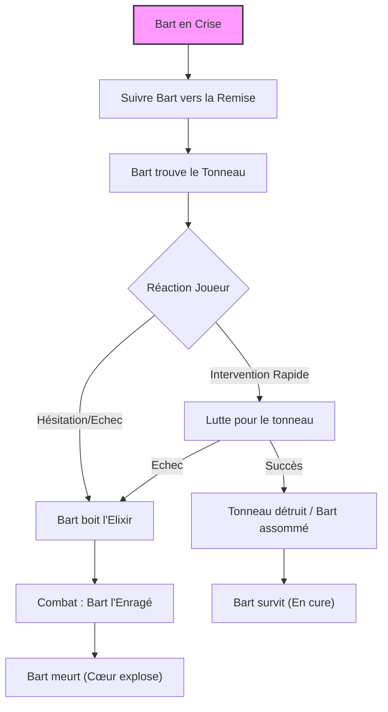

# Quête : Le Sevrage

## Synopsis & Hook
> [!abstract] Objectif
> Arrêter Bart, un ancien "béni" (qui a bu l'eau), qui cherche désespérément à retrouver sa force perdue en volant un tonneau caché.
> **Accroche :** Bart est à genoux sur la place, pleurant et suppliant qu'on lui rende "sa gloire". Il devient violent quand on l'approche.

---

## Graphe de Décision (Logic)

## Scènes & Embranchements

### Scène 1 : Le Manque (Place du Village)

> [!read-aloud] Description
> "Sur la place du village, un homme est recroquevillé dans la poussière. Il est maigre, ses vêtements flottent sur lui comme s'il avait perdu vingt kilos en une nuit. Il tremble violemment. 'Rendez-la moi !' hurle-t-il d'une voix brisée. 'Je pouvais soulever le monde ! Pourquoi vous me l'avez reprise ?'"

- **Bart :** Il est en état de manque absolu. Il s'enfuit soudainement, rampant presque, vers une ruelle sombre, hurlant qu'il "sait où il en reste".
- **Poursuite :** Si les joueurs ne le suivent pas immédiatement, ils entendront des fracas de bois quelques minutes plus tard.

### Scène 2 : La Tentation (La Remise)
- **Lieu :** Une remise oubliée, poussiéreuse. Au fond, un petit fût marqué d'une croix, oublié là avant la fermeture du puits.
- **Le Dilemme :** Bart est penché sur le fût, essayant frénétiquement de l'ouvrir avec ses ongles ensanglantés.
    - **Action Rapide (Initiative) :** Les joueurs peuvent tenter de briser le fût ou d'assommer Bart avant qu'il ne boive (CA 10, 5 PV dans cet état).
    - **Si on attend :** Il défonce le couvercle et plonge la tête dedans.

### Scène 3A : L'Abomination (Si Bart boit)
- **Transformation :** C'est instantané et horrible.
    > "Un craquement humide résonne. Bart se redresse, hurlant de rire et de douleur. Ses muscles gonflent à vue d'œil, déchirant sa chemise et sa peau. Des veines noires palpitent sur son cou. Il se tourne vers vous, bavant une écume violette. 'OUI ! LA PUISSANCE ! JE VAIS TOUT ÉCRASER !'"
- **Combat Boss :** Utilisez le statblock de **Bart **.
    - C'est un combat contre la montre. Bart est surpuissant mais perd des PV à chaque tour. Il ne se soucie pas de sa défense, il veut juste détruire.
    - **Issue :** Même si les joueurs le "tuent", c'est son cœur qui lâche en premier. Il meurt dans une explosion de sang et de bile.

### Scène 3B : Le Sevrage (Si le tonneau est détruit)
- **Réaction :** Bart s'effondre en pleurs, comme un enfant. Il est brisé psychologiquement.
- **Conclusion :** Il faudra le confier à **[[Aveline]]** pour qu'elle tente de le désintoxiquer avec des plantes apaisantes. Il survivra, mais restera faible longtemps.

---

## Conséquences sur le Monde (World State)

- **Si Bart boit :**
    - Bart meurt.
    - Les villageois sont terrifiés par ce qu'ils ont vu (l'effet final de l'eau).
    - `reputation_trepied` inchangée (c'est tragique).

- **Si Bart est sauvé :**
    - Bart survit.
    - `reputation_trepied` +1 (Compassion).
    - Le joueur gagne la reconnaissance d'Aveline.

---

## Notes de Session (Log)

- **Choix des joueurs :** ...