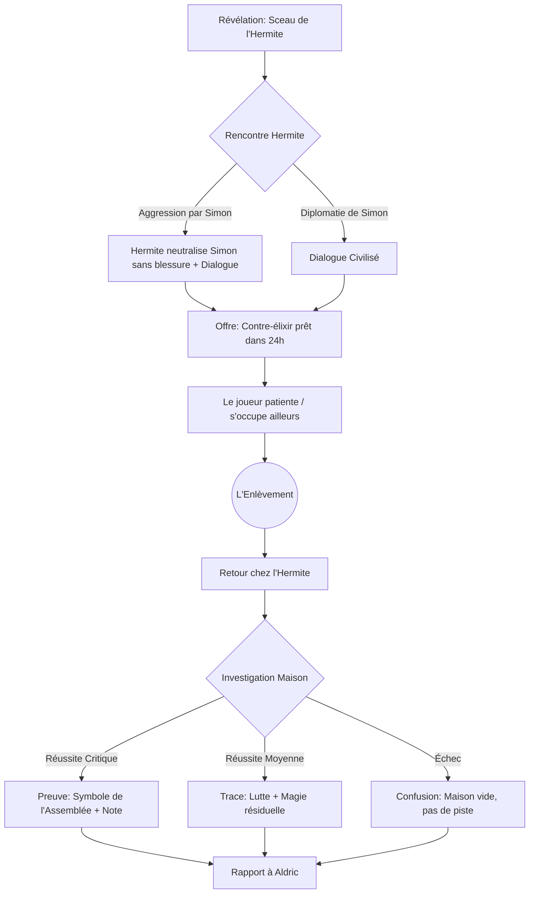

# MASTER_CAMPAIGN_LOGIC.md
> **Système Central de la Campagne**
> Source de vérité unique. Définit l'état mondial, les variables et le graphe de dépendance.

## 1. État du Monde (World State)

### Variables Globales
- `date_actuelle`: "03/01/2026" (Post-Session 1)
- `jours_avant_expiration_pacte_aldric`: 364
- `is_aldric_identity_known`: `false`
- `is_hermite_kidnapped`: `false` (Va passer à true en Session 2)

### Variables de Faction
- **Aldric** : 
    - `statut`: A commandité l'enlèvement de l'Hermite (Secret).
    - `attitude_publique`: "Le protecteur bienveillant".
    - `attitude_privee`: "Le calculateur désespéré".
- **L'Hermite** :
    - `statut`: Innocent du crime, coupable de négligence (créateur des potions).
    - `capacité`: Niveau 10+ (Trop fort pour Simon).
    - `comportement`: Pacifique mais secret.
- **Village de Trépied** :
    - `statut_puits`: "Toujours contaminé".
    - `solution_en_cours`: "Contre-élixir (50% progress)".
    - `is_pataud_granted`: `false` (Sera déterminé après la Quête D).

---

## 2. Graphe Narratif (Corrigé)

---

## 3. Anticipation des Outcomes (Pour Aldric)

Voici comment Aldric réagira selon ce que Simon lui rapporte (basé sur l'investigation de la maison) :

### Cas A : Le Joueur rapporte des preuves solides (Symbole de l'Assemblée trouvé)
*   **Réalité** : Aldric reconnait son propre groupe, mais doit feindre la surprise.
*   **Réaction Aldric** : "Ce symbole... C'est une secte dangereuse que nous traquons. L'Assemblée. Tu as mis le doigt sur quelque chose de grave, Simon. Je te charge officiellement de les traquer."
*   **Conséquence** : Simon obtient une piste directe vers l'Arc 2.

### Cas B : Le Joueur rapporte juste une disparition (Traces de lutte)
*   **Réalité** : Aldric est soulagé que Simon ne sache rien, mais doit le mettre sur la piste pour le "tester".
*   **Réaction Aldric** : "Un enlèvement ? C'est inquiétant. Mes divinateurs ont senti une perturbation vers l'Est. Va voir là-bas."
*   **Conséquence** : Aldric donne l'indice lui-même (manipulation).

### Cas C : Le Joueur ramène le Contre-Élixir inachevé
*   **Action** : Trouvé sur la table de l'Hermite.
*   **Réaction Aldric** : "Donne-moi ça. Nos alchimistes vont le terminer pour sauver le village. Toi, concentre-toi sur les coupables."
*   **Conséquence** : Le Puits est sauvé par l'Église (Aldric gagne en réputation), Simon est libéré pour la chasse.

---

## 4. Quêtes Actives (Mise à jour)

### Quête Principale : Le Puits (Phase Finale)
- [x] Identifier la source
- [ ] Obtenir l'aide de l'Hermite (Accord verbal)
- [ ] Découvrir la disparition
- [ ] Rapporter à Aldric (Fin de l'Arc 1)

### Quêtes Secondaires (Downtime 24h)
*Voir `_Technical/_quests/Side_Quests_Trepied.md`*
- [ ] **A. Des Rats Énormes** : Nettoyer la cave de l'auberge (Combat rats dopés).
- [ ] **B. Le Piège de la Vanité** : Sauver le fermier coincé (Challenge physique).
- [ ] **C. Le Fantôme du Grenier** : Enquête sur des vols (Dilemme moral).

### Quête Secondaire : Le Sort de l'Hermite (Transition Arc 2)
- [ ] Fouiller la maison (Trouver indices Kidnapping)
- [ ] Sécuriser les notes/l'élixir