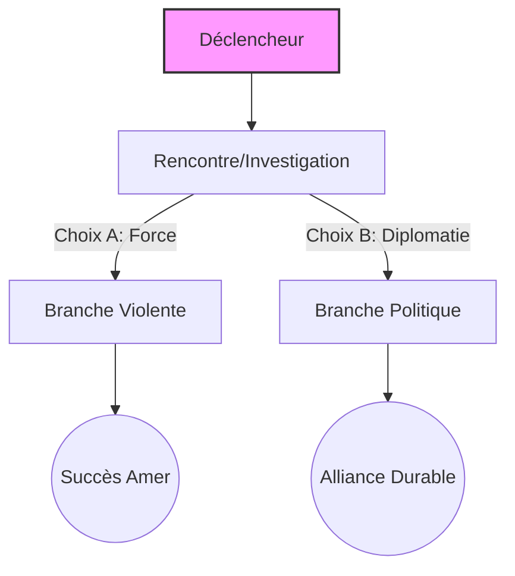

# Quête : {{title}}

## Synopsis & Hook
> [!abstract] Objectif
> Résumé court de l'enjeu. Pourquoi les joueurs s'y intéressent-ils ?
> **Accroche :** Ce que le PNJ dit ou l'événement qui déclenche la quête.

---

## Graphe de Décision (Logic)



| **Entité**       | **Rôle**         | **Intérêt**                     |
| ---------------- | ---------------- | ------------------------------- |
| [[Nom du PNJ]]   | Donneur de quête | Récupérer l'artefact.           |
| [[Nom du PNJ 2]] | Antagoniste      | Empêcher la vérité d'éclater.   |
| [[La Guilde X]]  | Observateur      | Veut racheter l'objet à la fin. |
 


 ## Scènes & Embranchements

### Scène 1 : L'Investigation

- **Objectif :** Trouver l'entrée du repaire.
    
- **Défis :** - [ ] Investigation (DC 14) : Trouve une entrée secrète.
    
    - [ ] Persuasion (DC 16) : Convainc le garde de parler.
        
- **Variables logiques :**
    
    - _Si réussite critique_ : Débloque l'option `Infiltration Facile`.
        
    - _Si échec_ : Alerte les gardes (ajoute +2 ennemis à la scène finale).
        

### Scène 2A : Branche Violente (Le Repaire)

- **Combat :** Voir [[Statblock_Générique_Gardes]].
    
- **Butin :** 50gp, une lettre de [[Le Traître]].
    

### Scène 2B : Branche Diplomatique (La Négociation)

- **Enjeu :** Convaincre le chef des bandits de trahir son employeur.
    
- **Conséquence :** Le bandit devient un allié pour la quête [[QST-005]].
    

---

## Conséquences sur le Monde (World State)

_Cette section est cruciale pour que Gemini mette à jour ton Lore._

- **Si Succès :**
    
    - `reputation_ville_X` : +10
        
    - `is_bandit_leader_alive` : true/false
        
    - **Note :** Créer la note de rumeur dans `[[Journal des Rumeurs]]`.
        
- **Si Échec :**
    
    - `reputation_ville_X` : -5
        
    - Le PNJ [[Donneur de quête]] refuse de parler au groupe pendant 1 mois.
        

---

## Notes de Session (Log)

_(À remplir après la partie pour que Claude puisse analyser le résultat)_

- **Choix des joueurs :** ...
    
- **Imprévus :** ...
    

````

---

## Comment l'utiliser avec tes IAs ?

### 1. Avec Claude Code (L'exécutant)
Demande-lui :
> *"Claude, crée une nouvelle quête basée sur le template. Le sujet est une trahison au sein de la garde de [[Ville_A]]. Utilise le PNJ [[Capitaine_Vael]] comme donneur de quête. Assure-toi que si les joueurs découvrent la lettre, cela mène à un embranchement vers la faction [[Culte_Sombre]]."*

### 2. Avec Gemini (L'Architecte)
Une fois la quête écrite par Claude, demande à Gemini :
> *"Gemini, lis le fichier de cette nouvelle quête. En fonction de mon dossier `_atlas/`, est-ce que les récompenses proposées sont cohérentes avec l'économie locale ? Est-ce que le PNJ [[Capitaine_Vael]] a une motivation solide pour trahir, ou est-ce que ça contredit sa fiche personnage dans `_cast/` ?"*

### 3. Avec Obsidian (Toi)
Grâce au plugin **Dataview**, tu peux créer une page "Tableau de Bord" qui affiche toutes tes quêtes en cours en lisant simplement les propriétés (Frontmatter) de ce template :
```sql
TABLE status, priority, location
FROM "30_ARC_PRINCIPAL"
WHERE type = "quest"
````